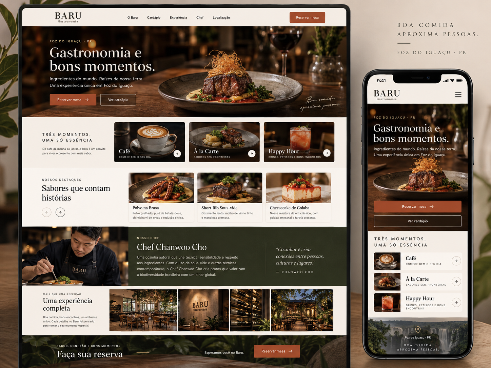
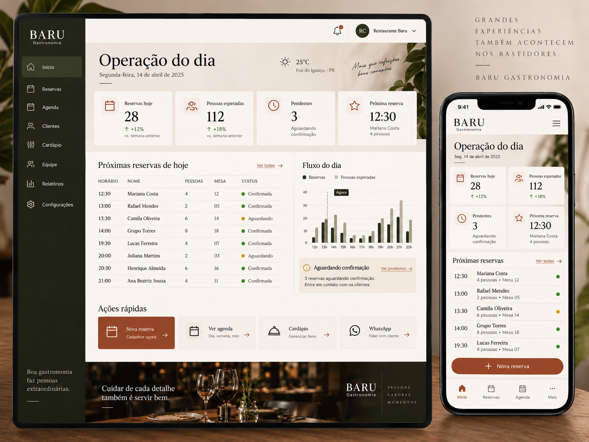
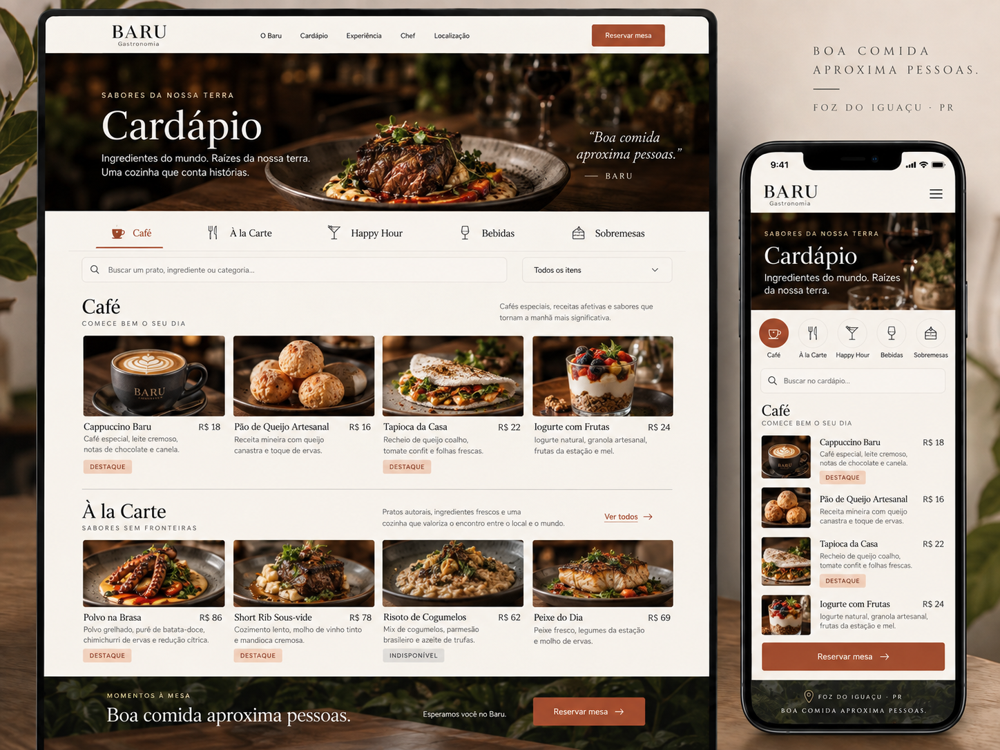
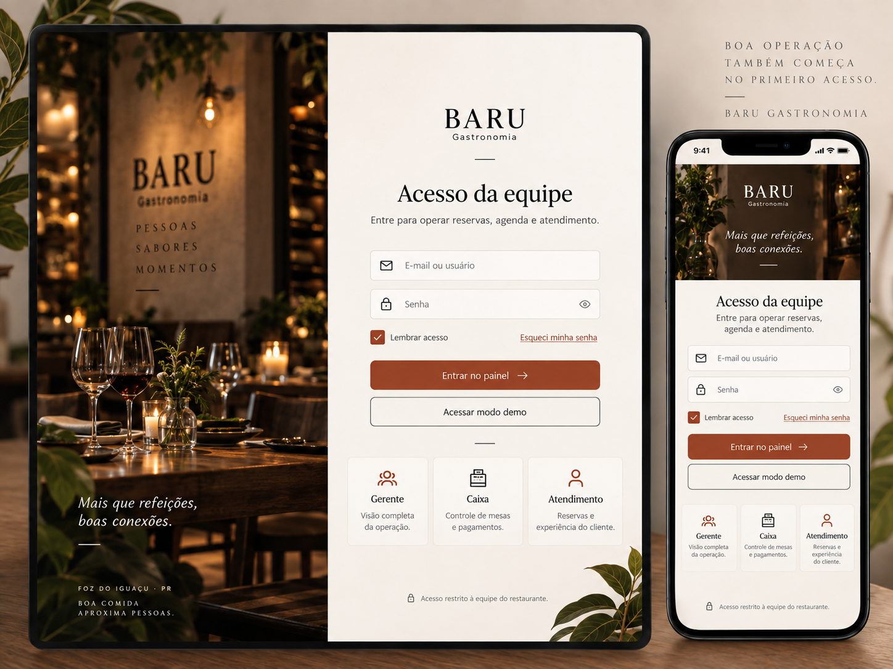
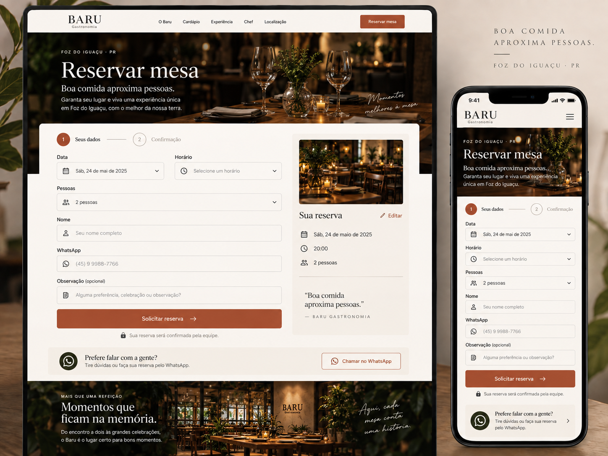
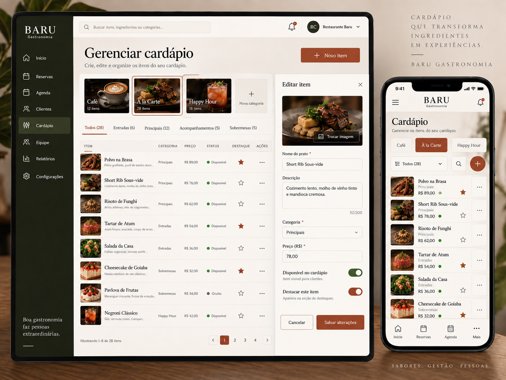
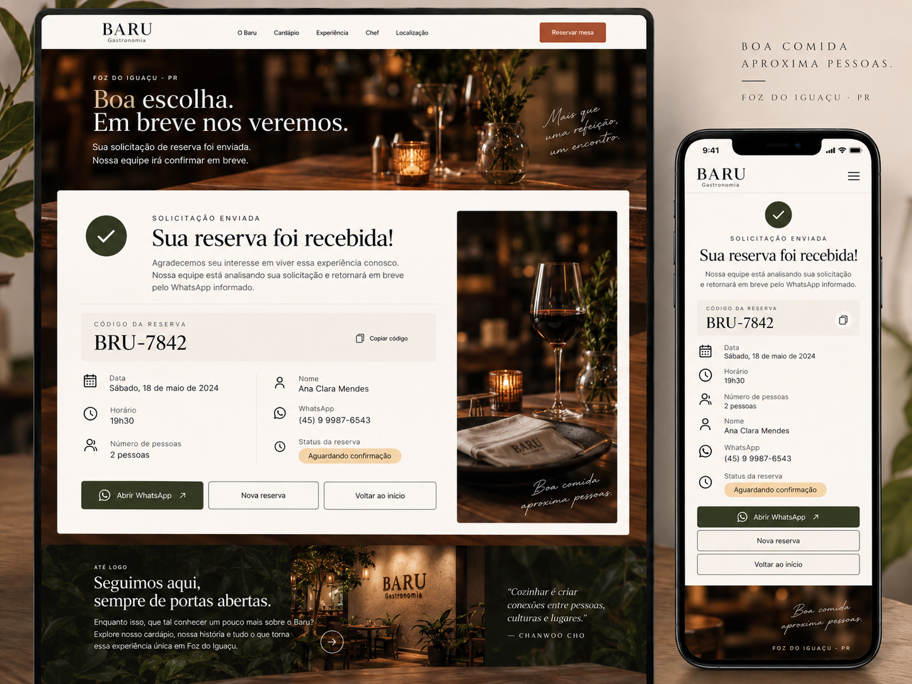
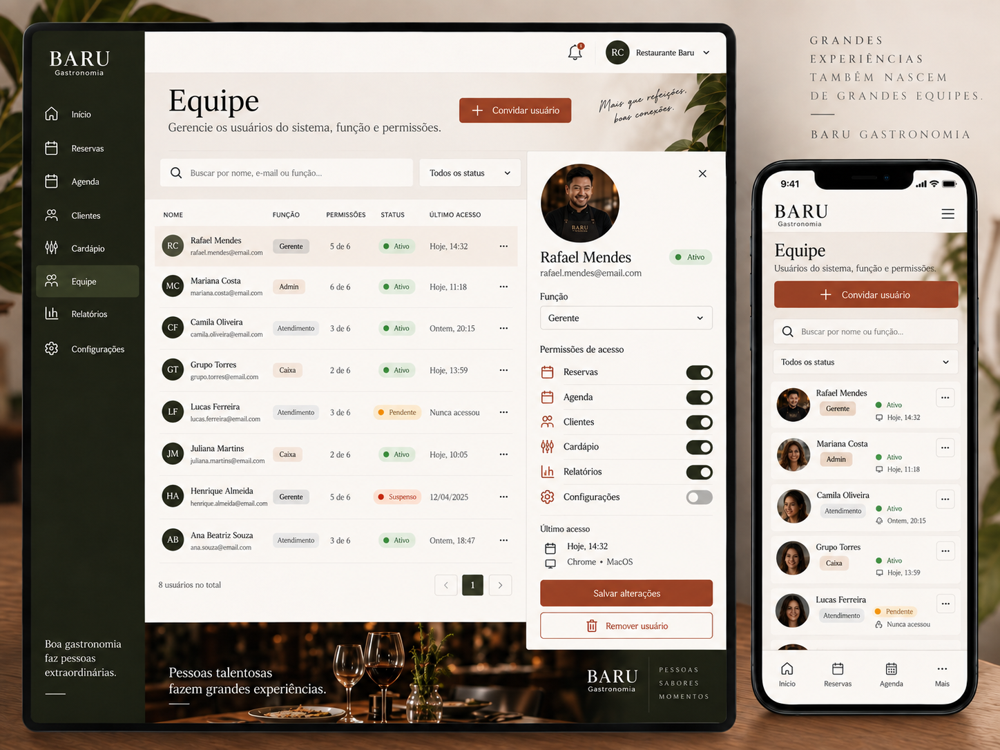

# Baru Gastronomia

Produto web do Baru Gastronomia para presença pública, cardápio, pedidos online, reservas e operação administrativa. A aplicação publicada usa Firebase real para autenticação e dados operacionais; o modo demo continua disponível somente para desenvolvimento/apresentação local.

## O que está publicado

- Worker: [baru-gastronomia.acai-mais-sabor.workers.dev](https://baru-gastronomia.acai-mais-sabor.workers.dev/)
- Firebase: `restaurante-5665d`
- Pedidos internos: catálogo, carrinho, checkout e acompanhamento dentro do site do Baru
- Canal externo opcional: [iFood](https://www.ifood.com.br/delivery/ok-ok/ok/2f8d493e-c173-4669-899e-1483e9fffb12?UTM_Medium=share)
- Cardápio oficial: [cardapio.barugastronomia.com.br](https://cardapio.barugastronomia.com.br/)

O catálogo real publicado no Firebase foi cadastrado a partir do cardápio oficial: 23 categorias, 339 itens ativos, 3 agrupamentos de navegação e 3 destaques na home. Os preços, descrições e imagens exibidos em `/cardapio` vêm dessa carga real. O cliente abre o produto, personaliza, adiciona ao carrinho, escolhe retirada/entrega/consumo no local conforme a configuração publicada e conclui o pedido no próprio Baru.

O endpoint `POST /api/orders` recalcula o preço no servidor a partir do catálogo Firebase, valida adicionais, aplica pedido mínimo/taxa/configurações, protege contra duplicidade por `clientRequestId`, grava pedido privado + projeção pública e usa limite antiabuso por IP hashado em Cloudflare KV. O cliente acompanha em `/pedido/[codigo]`; clientes autenticados também veem `/conta/pedidos` e podem pedir novamente. A equipe opera os estados em `/admin/pedidos`.

`restaurantSettings/main` também está publicado com o endereço, WhatsApp e horários operacionais reais/confirmados para o ambiente atual. A solicitação pública de reserva passa por `POST /api/reservations`, no Worker, com validação, rate limit persistente por IP hashado em Cloudflare KV, idempotência e locks transacionais. O painel `/admin/mesas` agora cadastra áreas e mesas diretamente no Firebase com validação de capacidade e Rules; como ainda não há estrutura operacional confirmada cadastrada, o endpoint recusa novas reservas com mensagem explícita. Nenhum layout fictício foi usado para simular disponibilidade.

O endereço padrão do Worker ainda pertence ao namespace Cloudflare disponível nesta conta. O domínio próprio do Baru continua sendo uma configuração externa pendente.

Estado auditado nesta rodada: **88% de maturidade**, com produção controlada. O núcleo de pedidos internos, catálogo CRUD, adicionais, caixa, finanças, promoções e configuração de zonas já está implementado em Firebase/Worker. QR de mesa, notificações completas, App Check, dados operacionais finais e QA concorrente ainda precisam ser fechados antes de declarar prontidão irrestrita.

## Prints de referência e telas

As imagens abaixo são as referências visuais oficiais usadas para implementar as telas reais. Elas ficam versionadas em `docs/referencias-visuais/` e não são usadas como background para fingir funcionamento.

| Público | Operação |
| --- | --- |
|  |  |
|  |  |
|  |  |
|  |  |

## Acessos

O acesso administrativo real usa Firebase Authentication por e-mail e senha, com o papel lido em `users/{uid}` e reforçado pelas Firestore Rules. A credencial inicial de teste foi criada no projeto Firebase e deve ser trocada antes de qualquer uso operacional.

A área pública de cliente está em `/conta`. O cliente pode criar sua própria conta Firebase. Os pedidos são criados no site e associados à conta quando autenticada. A aplicação nunca armazena dados de cartão; “cartão” significa pagamento na entrega/retirada. O iFood permanece apenas como canal externo opcional.

## Rotas

Públicas: `/`, `/cardapio`, `/produto/[id]`, `/carrinho`, `/checkout`, `/conta`, `/conta/pedidos`, `/pedido/[codigo]`, `/reservar`, `/reserva/[codigo]`, `POST /api/reservations`, `POST /api/orders`.

Admin: `/admin/login`, `/admin`, `/admin/reservas`, `/admin/reservas/nova`, `/admin/reservas/[id]/editar`, `/admin/pedidos`, `/admin/pedidos/[id]`, `/admin/agenda`, `/admin/clientes`, `/admin/clientes/[id]`, `/admin/cardapio`, `/admin/catalogo`, `/admin/adicionais`, `/admin/mesas`, `/admin/equipe`, `/admin/relatorios`, `/admin/caixa`, `/admin/financas`, `/admin/promocoes`, `/admin/conteudo`, `/admin/configuracoes`, `/admin/configuracoes/pedidos`, `/admin/setup`.

## Desenvolvimento

```bash
npm install
npm run dev
```

Para desenvolvimento local com dados de apresentação, copie `.env.example` para `.env.local`. Para testar Firebase real, use `NEXT_PUBLIC_DATA_MODE=firebase` e não habilite os emuladores.

Quality gates:

```bash
npm run lint
npm run typecheck
npm test
npm run test:rules
npm run test:e2e
npm run test:e2e:auth # com E2E_ADMIN_EMAIL/E2E_ADMIN_PASSWORD
npm run audit
npm audit --omit=dev # 0 vulnerabilidades de produção
npm run build
```

## Firebase

O cliente usa o SDK modular e os adapters em `lib/baru-repository.ts` e `lib/customer-account.ts`. A configuração web é pública; chaves administrativas, tokens e arquivos `.env` reais não entram no Git.

```bash
copy .env.example .env.local
npm run test:rules
npm run deploy:firebase
```

O deploy do Firebase publica Authentication, Rules e índices. A aplicação web é publicada no Worker Baru:

```bash
npm run build
npx wrangler deploy --config wrangler.jsonc
```

## Arquitetura

- `app/`: rotas Vinext/React, incluindo conta do cliente e cardápio público.
- `components/`: shell público, shell admin e módulos de operação.
- `lib/baru-data.ts`: seeds explícitos apenas para o modo demo.
- `lib/baru-repository.ts`: adapters local/Firebase para catálogo, equipe, conteúdo, configurações e autenticação administrativa; a criação pública delega ao endpoint confiável.
- `app/api/reservations/route.ts`: fronteira server-side para receber reservas, validar o domínio e gravar a operação com credencial de serviço no Worker.
- `shared/order-domain.ts`: catálogo de venda, adicionais, cálculo server-side, carrinho e transições de pedido.
- `lib/order-repository.ts` e `components/order-context.tsx`: carrinho persistente, catálogo Firebase, conta do cliente e operação administrativa.
- `app/api/orders/route.ts`: fronteira confiável para criar pedidos, recalcular preços, aplicar idempotência e gravar `orders`, `publicOrders` e `orderRequests`.
- `lib/customer-account.ts`: autenticação Firebase e perfil privado do cliente.
- `shared/baru-domain.ts`: entidades, validações, status e formatação.
- `firestore.rules`: autorização por papel, perfil de cliente, pedidos privados/projeção pública e validações de dados.
- `playwright.config.ts` e `tests/e2e/`: smoke público, casos adversariais, navegação dos módulos admin com sessão real e 404 do módulo removido.

## Documentação

Veja [arquitetura](docs/ARCHITECTURE.md), [Firebase](docs/FIREBASE.md), [deploy](docs/DEPLOYMENT.md), [segurança](docs/SECURITY.md), [testes](docs/TESTING.md) e [auditoria final](docs/AUDITORIA-FINAL.md).
